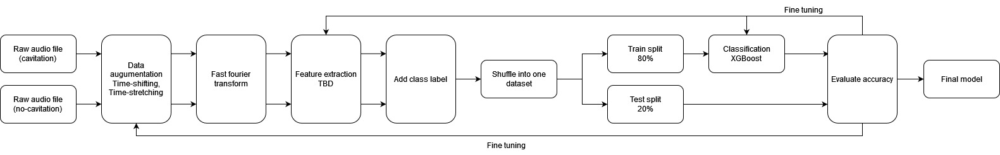

# Code to Interdisciplinary project at TU Wien

## Topic Cavitation Detection in pumps using Machine learning

### Abstract

This project was carried out in cooperation with Senzoro GmbH.
Pumps maintained in industrial systems may get into a state of cavitation, causing vibration
and shock waves that can damage the pump components.
This project aims to develop a machine learning model that can classify cavitation in pumps
using an ultrasound sensor that measures acoustic signals induced by the bursting bubbles.
The model will be trained on data that was collected through several experiments designed
to replicate the state of cavitation. The performance of the ML model will be evaluated using
standard metrics such as accuracy, precision, and especially recall.
The findings in this report suggest that a ML model trained on data obtained through experi-
ments could indeed detect unseen cavitation data originating from industrial pumps. Although,
it needs to be mentioned that the test set size was rather small and it remains to be seen if the
model will perform well on a larger, more diverse set of data.

More information and results in the report Interdisciplinary_project_report_Final.pdf

**Author**: Yu, Kinoshita
e1623806@student.tuwien.ac.at
kinoshita.yk@icloud.com

**Supervisor**: Markus, Valtiner (Applied Interface Physics)

**Co-Supervisor**: Thomas, Gärtner (Machine Learning)

### How to run:

To train and evaluate all SVM models used in this project, run train_and_eva_all_models.py

Data sets from the experiments can be made available on inquiry.
The Senzoro GmbH Testing data set will not be made public.